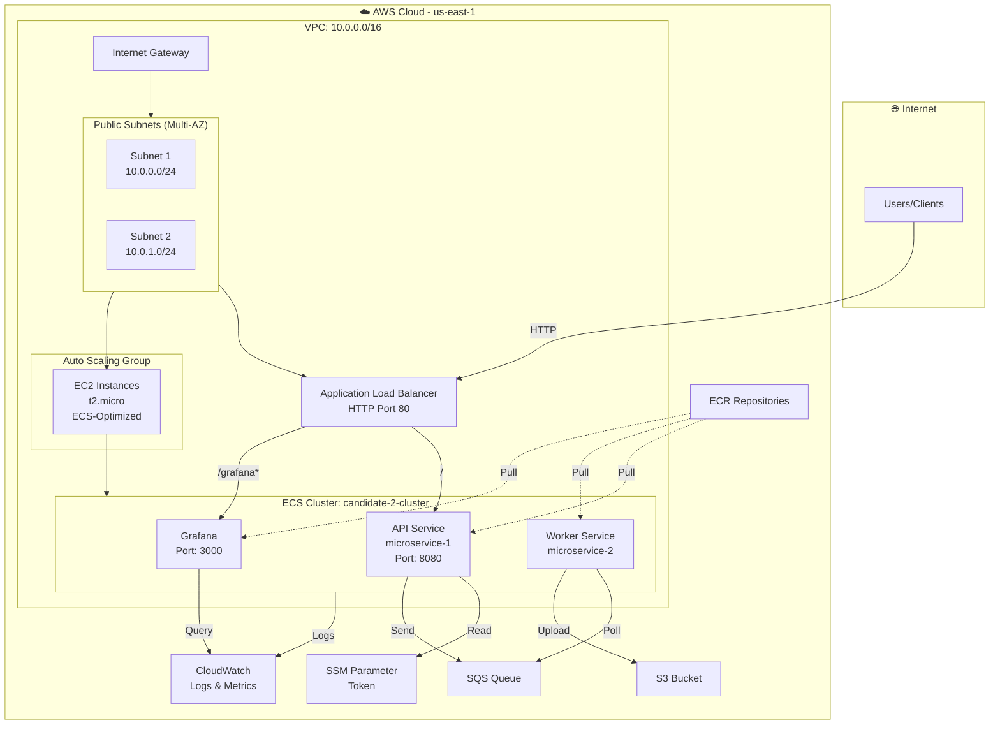

# Architecture Diagram

```mermaid
graph TB
    subgraph Internet["🌐 Internet"]
        Users["Users/Clients"]
    end

    subgraph AWS["☁️ AWS Cloud - us-east-1"]
        subgraph VPC["VPC: 10.0.0.0/16"]
            IGW["Internet Gateway"]
            
            subgraph Subnets["Public Subnets (Multi-AZ)"]
                Subnet1["Subnet 1<br/>10.0.0.0/24"]
                Subnet2["Subnet 2<br/>10.0.1.0/24"]
            end
            
            ALB["Application Load Balancer<br/>HTTP Port 80"]
            
            subgraph ASG["Auto Scaling Group"]
                EC2["EC2 Instances<br/>t2.micro<br/>ECS-Optimized"]
            end
            
            subgraph ECS["ECS Cluster: candidate-2-cluster"]
                API["API Service<br/>microservice-1<br/>Port: 8080"]
                Worker["Worker Service<br/>microservice-2"]
                Grafana["Grafana<br/>Port: 3000"]
            end
        end
        
        SQS["SQS Queue"]
        S3["S3 Bucket"]
        SSM["SSM Parameter<br/>Token"]
        ECR["ECR Repositories"]
        CloudWatch["CloudWatch<br/>Logs & Metrics"]
    end

    Users -->|HTTP| ALB
    ALB -->|/| API
    ALB -->|/grafana*| Grafana
    IGW --> Subnets
    Subnets --> ALB
    Subnets --> EC2
    EC2 --> ECS
    API -->|Read| SSM
    API -->|Send| SQS
    Worker -->|Poll| SQS
    Worker -->|Upload| S3
    ECR -.->|Pull| API
    ECR -.->|Pull| Worker
    ECR -.->|Pull| Grafana
    ECS -->|Logs| CloudWatch
    Grafana -->|Query| CloudWatch
```

