# 🏗️ DevOps Exam - Architecture Diagram

## System Architecture Overview

```mermaid
%%{init: {'theme':'base', 'themeVariables': { 'primaryColor':'#ff6f00','primaryTextColor':'#fff','primaryBorderColor':'#7C0000','lineColor':'#F8B229','secondaryColor':'#006100','tertiaryColor':'#fff'}}}%%
graph TB
    subgraph Internet["🌐 Internet"]
        Users["👥 Users/Clients"]
    end

    subgraph AWS["☁️ AWS Cloud - us-east-1"]
        subgraph VPC["🔷 VPC: 10.0.0.0/16"]
            IGW["🌐 Internet Gateway"]
            
            subgraph PublicSubnets["📍 Public Subnets (Multi-AZ)"]
                Subnet1["Subnet 1<br/>10.0.0.0/24<br/>us-east-1a"]
                Subnet2["Subnet 2<br/>10.0.1.0/24<br/>us-east-1b"]
            end
            
            subgraph ALB["⚖️ Application Load Balancer"]
                ALBListener["HTTP Listener<br/>Port 80"]
                ALBRule["Path Rule<br/>/grafana* → Grafana"]
            end
            
            subgraph TargetGroups["🎯 Target Groups"]
                APITG["API Target Group<br/>Port 80<br/>Health: /health"]
                GrafanaTG["Grafana Target Group<br/>Port 3000<br/>Health: /api/health"]
            end
            
            subgraph ASG["📈 Auto Scaling Group"]
                EC2_1["🖥️ EC2 Instance 1<br/>t2.micro<br/>ECS-Optimized"]
                EC2_2["🖥️ EC2 Instance 2<br/>t2.micro<br/>(Optional)"]
            end
            
            subgraph ECSCluster["🐳 ECS Cluster<br/>candidate-2-cluster"]
                subgraph APIService["📦 ECS Service 1<br/>microservice-1-producer"]
                    APIContainer["Container<br/>Port: 8080<br/>CPU: 128 | Memory: 128MB"]
                end
                
                subgraph WorkerService["📦 ECS Service 2<br/>microservice-2-consumer"]
                    WorkerContainer["Container<br/>CPU: 128 | Memory: 128MB"]
                end
                
                subgraph GrafanaService["📊 ECS Service 3<br/>Grafana"]
                    GrafanaContainer["Container<br/>Port: 3000<br/>CPU: 256 | Memory: 512MB"]
                end
            end
        end
        
        subgraph StorageServices["💾 Storage & Data Services"]
            SQS["📨 SQS Queue<br/>candidate-2-queue<br/>24h Retention"]
            S3["🪣 S3 Bucket<br/>candidate-2-data-*<br/>Versioning Enabled"]
            SSM["🔐 SSM Parameter<br/>/candidate-2/auth_token<br/>SecureString"]
            ECR["📦 ECR Repositories<br/>microservice-1<br/>microservice-2<br/>grafana"]
        end
        
        subgraph Monitoring["📊 Monitoring & Logging"]
            CloudWatch["📈 CloudWatch Logs<br/>/ecs/candidate-2"]
            Metrics["📊 CloudWatch Metrics<br/>ALB, ECS, SQS"]
        end
        
        subgraph Security["🔒 Security"]
            ALBSG["🛡️ ALB Security Group<br/>Ingress: Port 80<br/>Egress: All"]
            ECSSG["🛡️ ECS Security Group<br/>Ingress: From ALB<br/>Egress: All"]
            IAMRoles["👤 IAM Roles<br/>Execution Role<br/>Task Role<br/>Instance Role"]
        end
    end

    %% User connections
    Users -->|HTTP POST<br/>Port 80| ALBListener
    Users -->|HTTP GET<br/>/grafana*| ALBRule
    
    %% ALB routing
    ALBListener -->|Default Route| APITG
    ALBRule -->|Path-based| GrafanaTG
    
    %% Target group to services
    APITG -->|Port 80 → 8080| APIContainer
    GrafanaTG -->|Port 3000| GrafanaContainer
    
    %% Network flow
    IGW -.->|Internet Access| PublicSubnets
    PublicSubnets --> ALB
    PublicSubnets --> EC2_1
    PublicSubnets --> EC2_2
    EC2_1 --> ECSCluster
    EC2_2 --> ECSCluster
    
    %% API Service connections
    APIContainer -->|Reads Token| SSM
    APIContainer -->|Sends Messages| SQS
    APIContainer -->|Writes Logs| CloudWatch
    
    %% Worker Service connections
    WorkerContainer -->|Polls Messages<br/>Every 20s| SQS
    WorkerContainer -->|Uploads Files| S3
    WorkerContainer -->|Writes Logs| CloudWatch
    
    %% Grafana connections
    GrafanaContainer -->|Queries Metrics| Metrics
    GrafanaContainer -->|Reads Logs| CloudWatch
    
    %% ECR connections
    ECR -.->|Pulls Images| APIContainer
    ECR -.->|Pulls Images| WorkerContainer
    ECR -.->|Pulls Images| GrafanaContainer
    
    %% Security
    ALBSG -.->|Protects| ALB
    ECSSG -.->|Protects| EC2_1
    ECSSG -.->|Protects| EC2_2
    IAMRoles -.->|Authorizes| APIContainer
    IAMRoles -.->|Authorizes| WorkerContainer
    IAMRoles -.->|Authorizes| GrafanaContainer
    
    %% Styling
    classDef internet fill:#e3f2fd,stroke:#1976d2,stroke-width:3px,color:#000
    classDef compute fill:#fff3e0,stroke:#f57c00,stroke-width:2px,color:#000
    classDef storage fill:#f3e5f5,stroke:#7b1fa2,stroke-width:2px,color:#000
    classDef network fill:#e8f5e9,stroke:#388e3c,stroke-width:2px,color:#000
    classDef security fill:#ffebee,stroke:#c62828,stroke-width:2px,color:#000
    classDef monitoring fill:#e0f2f1,stroke:#00695c,stroke-width:2px,color:#000
    
    class Users internet
    class ALB,ALBListener,ALBRule,APITG,GrafanaTG,EC2_1,EC2_2,APIContainer,WorkerContainer,GrafanaContainer compute
    class SQS,S3,SSM,ECR storage
    class VPC,IGW,PublicSubnets,Subnet1,Subnet2,ASG,ECSCluster network
    class ALBSG,ECSSG,IAMRoles security
    class CloudWatch,Metrics monitoring
```

## Data Flow Sequence

## Network Topology

```mermaid
graph TB
    subgraph Internet["🌐 Internet"]
        Client["Client Applications"]
    end
    
    subgraph AWSRegion["AWS Region: us-east-1"]
        subgraph VPC["VPC: 10.0.0.0/16"]
            IGW["Internet Gateway"]
            
            subgraph AZ1["Availability Zone 1<br/>📍 us-east-1a"]
                Subnet1["Public Subnet 1<br/>10.0.0.0/24<br/>🔓 Auto-assign Public IP"]
                ALBNode1["ALB Node 1"]
                EC2Instance1["EC2 Instance 1<br/>t2.micro<br/>ECS Container Instance"]
            end
            
            subgraph AZ2["Availability Zone 2<br/>📍 us-east-1b"]
                Subnet2["Public Subnet 2<br/>10.0.1.0/24<br/>🔓 Auto-assign Public IP"]
                ALBNode2["ALB Node 2"]
                EC2Instance2["EC2 Instance 2<br/>t2.micro<br/>(Optional - Auto Scaling)"]
            end
            
            RouteTable["Route Table<br/>0.0.0.0/0 → Internet Gateway"]
        end
        
        subgraph ManagedServices["AWS Managed Services"]
            direction TB
            SQS_Service["📨 Amazon SQS<br/>Standard Queue"]
            S3_Service["🪣 Amazon S3<br/>Object Storage"]
            SSM_Service["🔐 Systems Manager<br/>Parameter Store"]
            ECR_Service["📦 Amazon ECR<br/>Container Registry"]
            CloudWatch_Service["📊 Amazon CloudWatch<br/>Logs & Metrics"]
        end
    end
    
    Client -->|HTTP/HTTPS| IGW
    IGW --> RouteTable
    RouteTable --> Subnet1
    RouteTable --> Subnet2
    
    Subnet1 --> ALBNode1
    Subnet1 --> EC2Instance1
    Subnet2 --> ALBNode2
    Subnet2 --> EC2Instance2
    
    ALBNode1 -.->|Load Balance| EC2Instance1
    ALBNode1 -.->|Load Balance| EC2Instance2
    ALBNode2 -.->|Load Balance| EC2Instance1
    ALBNode2 -.->|Load Balance| EC2Instance2
    
    EC2Instance1 -->|Access| SQS_Service
    EC2Instance1 -->|Access| S3_Service
    EC2Instance1 -->|Access| SSM_Service
    EC2Instance1 -->|Pull Images| ECR_Service
    EC2Instance1 -->|Send Logs| CloudWatch_Service
    
    EC2Instance2 -->|Access| SQS_Service
    EC2Instance2 -->|Access| S3_Service
    EC2Instance2 -->|Access| SSM_Service
    EC2Instance2 -->|Pull Images| ECR_Service
    EC2Instance2 -->|Send Logs| CloudWatch_Service
    
    style Internet fill:#e3f2fd,stroke:#1976d2,stroke-width:3px
    style VPC fill:#fff3e0,stroke:#f57c00,stroke-width:2px
    style AZ1 fill:#e8f5e9,stroke:#388e3c,stroke-width:2px
    style AZ2 fill:#e8f5e9,stroke:#388e3c,stroke-width:2px
    style ManagedServices fill:#f3e5f5,stroke:#7b1fa2,stroke-width:2px
```

## Security Architecture

```mermaid
graph LR
    subgraph IAM["👤 IAM Roles & Policies"]
        direction TB
        InstanceRole["EC2 Instance Role<br/>└─ AmazonEC2ContainerServiceforEC2Role<br/>   • Register with ECS cluster"]
        ExecRole["ECS Task Execution Role<br/>└─ AmazonECSTaskExecutionRolePolicy<br/>   • Pull images from ECR<br/>   • Write logs to CloudWatch"]
        TaskRole["ECS Task Role<br/>└─ Custom Policy<br/>   • SQS: * on queue<br/>   • S3: PutObject, GetObject<br/>   • SSM: GetParameter"]
        GrafanaRole["Grafana Task Role<br/>└─ Custom Policy<br/>   • CloudWatch: Read metrics<br/>   • CloudWatch Logs: Read logs"]
    end
    
    subgraph SecurityGroups["🛡️ Security Groups"]
        direction TB
        ALB_SG["ALB Security Group<br/>└─ Ingress: Port 80 from 0.0.0.0/0<br/>└─ Egress: All traffic"]
        ECS_SG["ECS Security Group<br/>└─ Ingress: Ports 0-65535 from ALB SG<br/>└─ Egress: All traffic"]
    end
    
    subgraph Resources["🔒 Protected Resources"]
        direction TB
        EC2["EC2 Instances"]
        ALB["Application Load Balancer"]
        API["API Service"]
        Worker["Worker Service"]
        Grafana["Grafana Service"]
    end
    
    InstanceRole -->|Assumed by| EC2
    ExecRole -->|Used by| API
    ExecRole -->|Used by| Worker
    ExecRole -->|Used by| Grafana
    TaskRole -->|Used by| API
    TaskRole -->|Used by| Worker
    GrafanaRole -->|Used by| Grafana
    
    ALB_SG -->|Protects| ALB
    ECS_SG -->|Protects| EC2
    ECS_SG -->|Protects| API
    ECS_SG -->|Protects| Worker
    ECS_SG -->|Protects| Grafana
    
    style IAM fill:#e1f5ff,stroke:#01579b,stroke-width:2px
    style SecurityGroups fill:#ffebee,stroke:#c62828,stroke-width:2px
    style Resources fill:#f3e5f5,stroke:#7b1fa2,stroke-width:2px
```

## Component Details Table

| Component | Type | Configuration | Purpose |
|-----------|------|---------------|---------|
| **VPC** | Virtual Private Cloud | CIDR: 10.0.0.0/16 | Isolated network environment |
| **Internet Gateway** | Network Gateway | Public internet access | Enables public connectivity |
| **Public Subnets** | Network Subnets | 2 subnets across 2 AZs | Host public-facing resources |
| **Application Load Balancer** | Load Balancer | HTTP (Port 80), Multi-AZ | Distributes traffic to services |
| **Target Groups** | Load Balancing | API (Port 80), Grafana (Port 3000) | Routes to specific services |
| **Auto Scaling Group** | Compute Scaling | Min: 1, Max: 2, Desired: 1 | Manages EC2 instances |
| **EC2 Instances** | Compute | t2.micro, ECS-optimized AMI | Host ECS containers |
| **ECS Cluster** | Container Orchestration | candidate-2-cluster | Manages container lifecycle |
| **ECS Service 1** | Container Service | microservice-1-producer | REST API service |
| **ECS Service 2** | Container Service | microservice-2-consumer | SQS worker service |
| **ECS Service 3** | Container Service | Grafana | Monitoring dashboard |
| **SQS Queue** | Message Queue | Standard queue, 24h retention | Message buffer |
| **S3 Bucket** | Object Storage | Versioning enabled | Stores processed data |
| **SSM Parameter** | Secrets Store | SecureString type | Stores auth token |
| **ECR Repositories** | Container Registry | 3 repositories | Docker image storage |
| **CloudWatch Logs** | Logging | /ecs/candidate-2 | Centralized logging |
| **CloudWatch Metrics** | Monitoring | ALB, ECS, SQS metrics | Performance metrics |

## Resource Sizing (Free Tier)

| Resource | Size | Free Tier Limit | Status |
|----------|------|-----------------|--------|
| EC2 Instances | t2.micro | 750 hours/month | ✅ Within limit |
| ECS Tasks | 128-256 CPU, 128-512 MB | Included | ✅ Optimized |
| S3 Storage | Variable | 5 GB | ✅ Within limit |
| SQS Requests | Variable | 1M requests/month | ✅ Within limit |
| ALB | Standard | 750 hours/month | ✅ Within limit |
| CloudWatch Logs | Variable | 5 GB ingestion | ✅ Within limit |
| ECR Storage | Variable | 500 MB/month | ✅ Within limit |

## Architecture Highlights

✨ **High Availability**: Multi-AZ deployment with auto-scaling  
🔒 **Security**: IAM roles, security groups, encrypted parameters  
📊 **Monitoring**: Grafana dashboard with CloudWatch integration  
💰 **Cost Optimized**: All resources within AWS Free Tier  
🚀 **Scalable**: Auto Scaling Group can scale 1-2 instances  
📝 **Observable**: Centralized logging and metrics collection  

