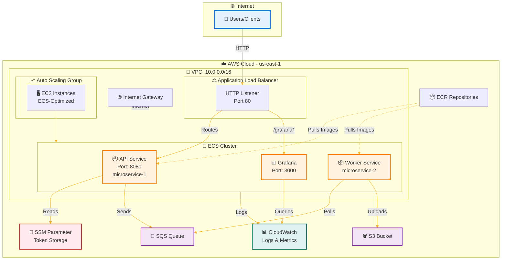
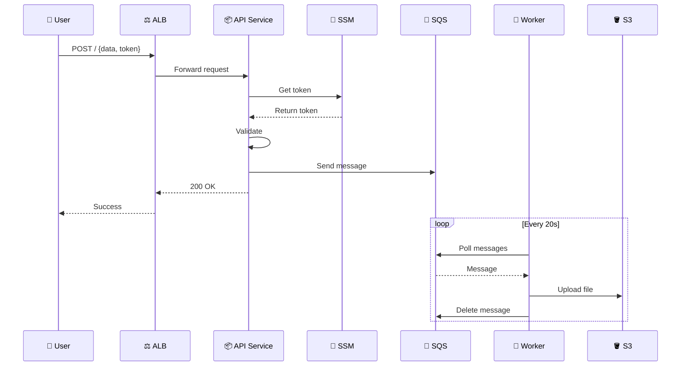
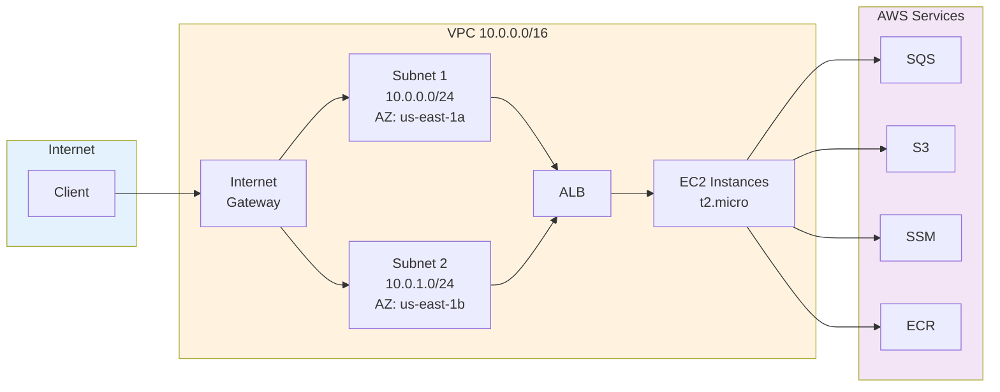

# 🏗️ DevOps Exam Architecture Diagram

## System Architecture

```mermaid
%%{init: {'theme':'default', 'themeVariables': {'primaryColor':'#ff6f00','primaryTextColor':'#fff','primaryBorderColor':'#7C0000','lineColor':'#F8B229','secondaryColor':'#006100','tertiaryColor':'#fff'}}}%%
graph TB
    subgraph Internet["🌐 Internet"]
        User["👤 Users/Clients"]
    end

    subgraph AWS["☁️ AWS Cloud - us-east-1"]
        subgraph VPC["🔷 VPC: 10.0.0.0/16"]
            IGW["🌐 Internet Gateway"]
            
            subgraph ALB["⚖️ Application Load Balancer"]
                Listener["HTTP Listener<br/>Port 80"]
            end
            
            subgraph ASG["📈 Auto Scaling Group<br/>t2.micro instances"]
                EC2["🖥️ EC2 Instances<br/>ECS-Optimized"]
            end
            
            subgraph ECS["🐳 ECS Cluster"]
                API["📦 API Service<br/>Port: 8080<br/>microservice-1"]
                Worker["📦 Worker Service<br/>microservice-2"]
                Grafana["📊 Grafana<br/>Port: 3000"]
            end
        end
        
        SQS["📨 SQS Queue"]
        S3["🪣 S3 Bucket"]
        SSM["🔐 SSM Parameter<br/>Token Storage"]
        ECR["📦 ECR Repositories"]
        CloudWatch["📊 CloudWatch<br/>Logs & Metrics"]
    end

    User -->|HTTP| Listener
    Listener -->|Routes| API
    Listener -->|/grafana*| Grafana
    IGW -.->|Internet| VPC
    EC2 --> ECS
    API -->|Reads| SSM
    API -->|Sends| SQS
    Worker -->|Polls| SQS
    Worker -->|Uploads| S3
    ECR -.->|Pulls Images| API
    ECR -.->|Pulls Images| Worker
    ECS -->|Logs| CloudWatch
    Grafana -->|Queries| CloudWatch
    
    style User fill:#e3f2fd,stroke:#1976d2,stroke-width:3px
    style API fill:#fff3e0,stroke:#f57c00,stroke-width:2px
    style Worker fill:#fff3e0,stroke:#f57c00,stroke-width:2px
    style Grafana fill:#fff3e0,stroke:#f57c00,stroke-width:2px
    style SQS fill:#f3e5f5,stroke:#7b1fa2,stroke-width:2px
    style S3 fill:#f3e5f5,stroke:#7b1fa2,stroke-width:2px
    style SSM fill:#ffebee,stroke:#c62828,stroke-width:2px
    style CloudWatch fill:#e0f2f1,stroke:#00695c,stroke-width:2px
```

## Data Flow

```mermaid
sequenceDiagram
    participant U as 👤 User
    participant A as ⚖️ ALB
    participant API as 📦 API Service
    participant SSM as 🔐 SSM
    participant SQS as 📨 SQS
    participant W as 🔄 Worker
    participant S3 as 🪣 S3

    U->>A: POST / {data, token}
    A->>API: Forward request
    API->>SSM: Get token
    SSM-->>API: Return token
    API->>API: Validate
    API->>SQS: Send message
    API-->>A: 200 OK
    A-->>U: Success
    
    loop Every 20s
        W->>SQS: Poll messages
        SQS-->>W: Message
        W->>S3: Upload file
        W->>SQS: Delete message
    end
```

## Network Layout

```mermaid
graph LR
    subgraph Internet["Internet"]
        Client["Client"]
    end
    
    subgraph VPC["VPC 10.0.0.0/16"]
        IGW["Internet<br/>Gateway"]
        Subnet1["Subnet 1<br/>10.0.0.0/24<br/>AZ: us-east-1a"]
        Subnet2["Subnet 2<br/>10.0.1.0/24<br/>AZ: us-east-1b"]
        ALB["ALB"]
        EC2["EC2 Instances<br/>t2.micro"]
    end
    
    subgraph Services["AWS Services"]
        SQS["SQS"]
        S3["S3"]
        SSM["SSM"]
        ECR["ECR"]
    end
    
    Client --> IGW
    IGW --> Subnet1
    IGW --> Subnet2
    Subnet1 --> ALB
    Subnet2 --> ALB
    ALB --> EC2
    EC2 --> SQS
    EC2 --> S3
    EC2 --> SSM
    EC2 --> ECR
    
    style Internet fill:#e3f2fd
    style VPC fill:#fff3e0
    style Services fill:#f3e5f5
```

